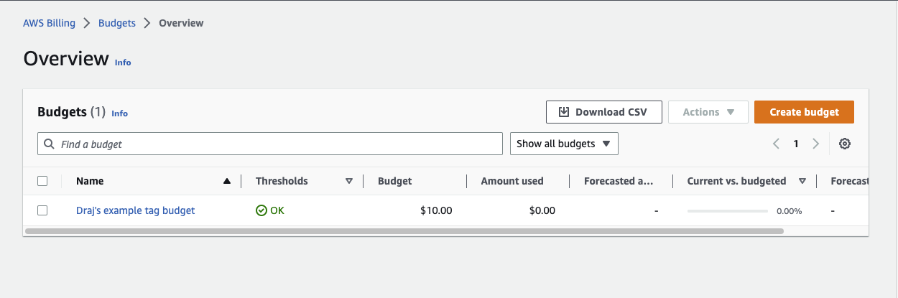
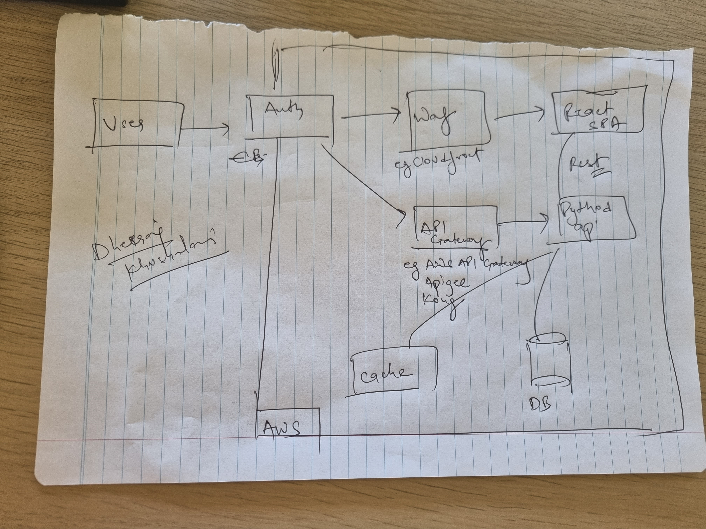
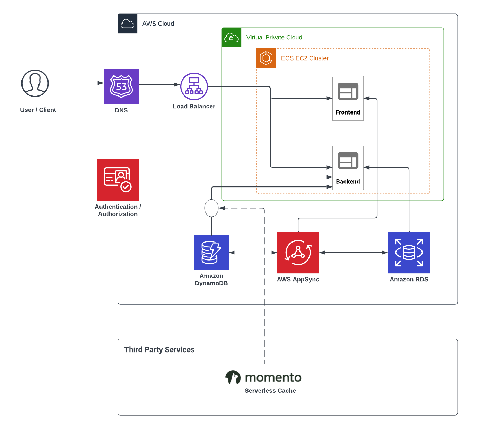
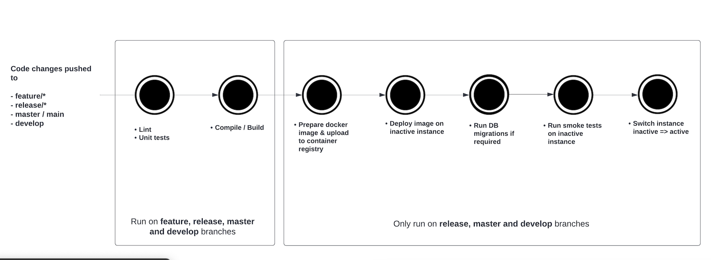

# Week 0 — Billing and Architecture

## Required Homework

### Billing and Budget Alarms

I created billing alarms via AWS CLI

Here are JSON configuration files for reference

- [alarm-config.json](../aws/json/alarm-config.json)
- [budget-notifications-with-subscribers.json](../aws/json/budget-notifications-with-subscribers.json)
- [budget.json](../aws/json/budget.json)

### Logical Architectural diagram

I first created a napkin design and then recreated the architecture diagram on Lucid charts.

I added WAF in front of frontend application and a API gateway in front of the API. 

Please note: I will update Lucid charts in coming weeks to find correct place of cloudfront and API Gateway. 

- 

- 

Here is lucidcharts commentable link.
[Lucidcharts commentable link](https://lucid.app/lucidchart/32957188-ff26-44b2-94a1-c993ba6a9dba/edit?viewport_loc=-53%2C-4%2C2317%2C1200%2C0_0&invitationId=inv_093d5a58-9ec3-41d5-814c-35e1aab6e0b1)

## Optional home work

### CI/CD pipeline diagram on lucid charts

1. Code is pushed to feature branch or merged using a pull request to release, master or develop branch.

2. Run code linting and unit tests to find problems in committed changes. 

3. Compile and build the code. 

4. Prepare a docker image with settings defined the repository and code built in last step. This step also publishes the built docker container on a container repository to be used in next step.

5. Deploy containter with infrastructure changes (like dynamo table, SSM params etc) to a inactive instance. Traffic would not be routed to this instance yet.

6. Run Database migrations (if any)

7. Run Smoke and other health tests on in-active instance to gain confidence.

8. Switch the instance and route traffic to the new instance.