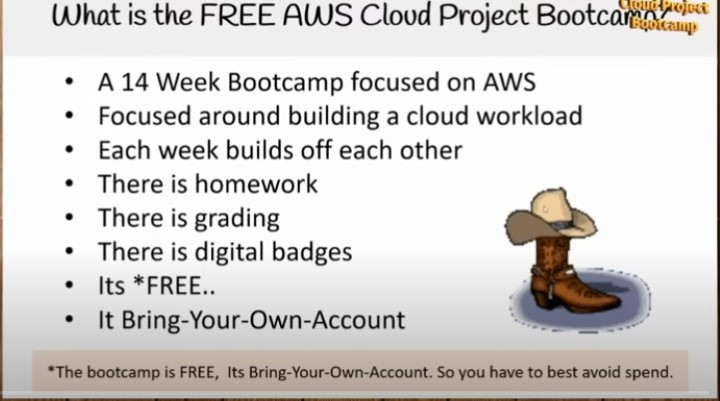
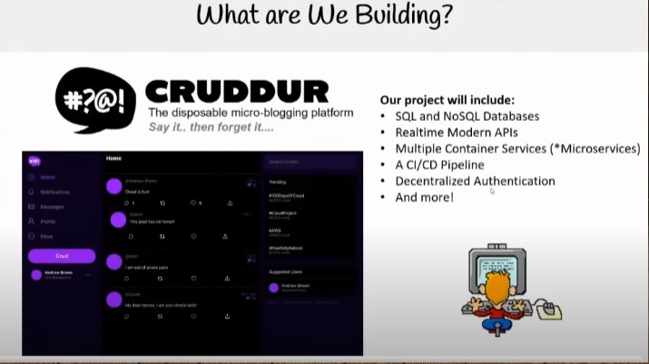
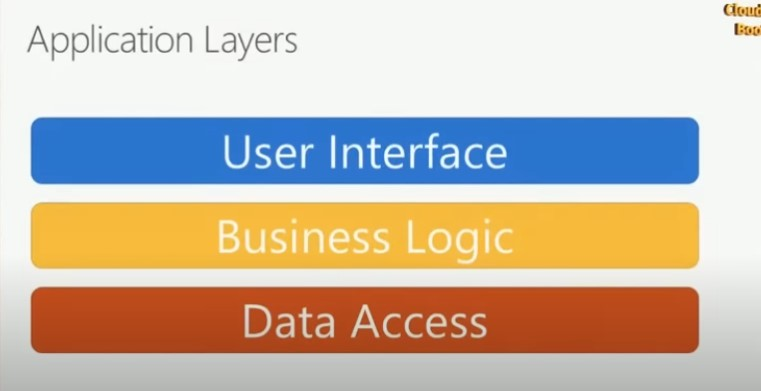
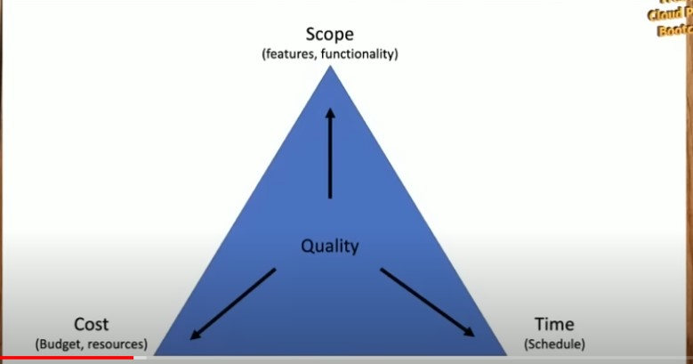
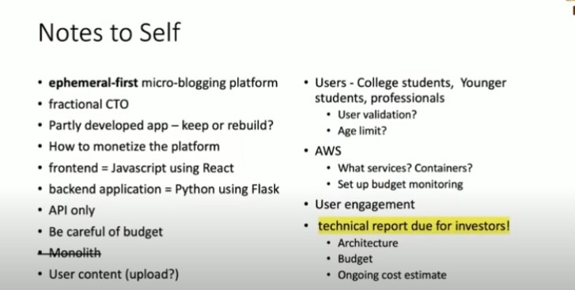
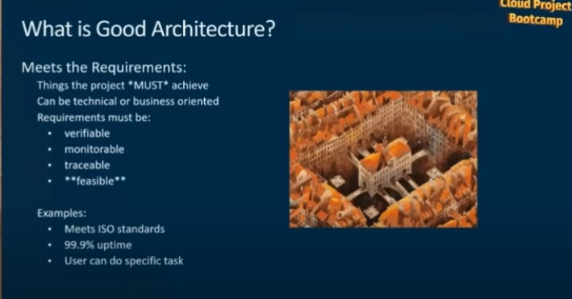
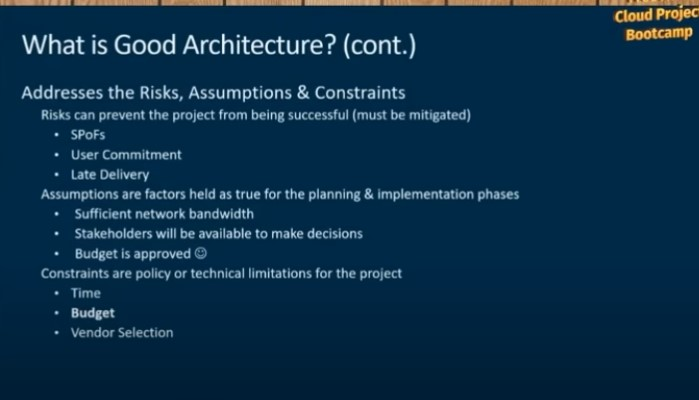
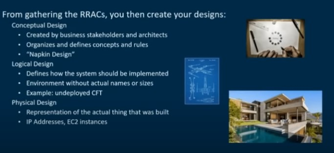
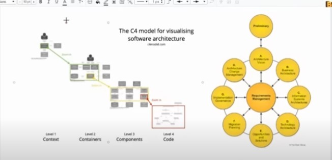
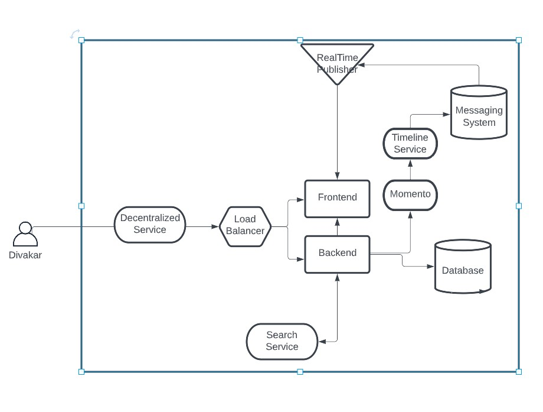

# Week 0 — Billing and Architecture

# **Bootcamp introduction and format**
---
 
 
<!-- Images -->

# **What are we building ?**
---

 
<!-- Images -->

# ** Project Scenario**

What we are going to do in this project.
* You joined a startup 
* First day of work walked into office
* Tony (manager) sets the context of the project
    * Fractional CTO
    * Micro Bloging  Platform
    * Expiring posts 
    * NoSQL or SQL
    * Authentication
    * Cruddur 
    * Scale Quickly
    * Lot of transactions
    * Time limited content
    * User Content and content creation
    * App is targeted to busy professionals, college students, Younger students. Company wants to limit the amount of trust and privacy issues

 **App Tech Stack**
 * Wire frame
 * Mock up web application  
 * Fund of 6 months salary
 * Fractional CTO is a part time teacher
 * Choice to start all over
 * ORM 
 * Monolithic application
 * Technical road map ready
 * Sprint cycle 
 
  
<!-- Images -->

* What we have and what we are trying to achieve 

<!-- Images -->

**Important Note:** Business Logic is to be separated from UI. Authentication etc to be moved out. End goal is to move away from monolithic  application towards micro service application.

**Cost Effective AWS Solution**
    * Iron triangle - The budget. The scope. The schedule

<!-- Images -->

**Proposed Tech Stack**
* Front end Javascript 
* Backend API's using Python using flask
* ORM - NoSql or Sql

**Self Notes:**
<!-- Images -->

 # ** What is Good Architecture?**
 
<!-- Images -->

<!-- Images -->

<!-- Images -->

**AWS considerations**
* Well architected design
    * Operational Excellence Pillar
    * Reliability Pillar
    * Security Pillar
    * Performance Pillar
    * Cost Optimization Pillar
    * Sustainability Pillar

**The C4 model for visualizing software architecure **

<!-- Images -->

* Conceptual Design 
<!-- Images -->

* Logical Design
<!-- Images -->

* Physical Design

# **Homework Challenges**

  
* Destroy your root account credentials, Set MFA, IAM role
* Use EventBridge to hookup Health Dashboard to SNS and send notification when there is a service health issue.
* Review all the questions of each pillars in the Well Architected Tool (No specialized lens)
* Create an architectural diagram (to the best of your ability) the CI/CD logical pipeline in Lucid Charts
* Research the technical and service limits of specific services and how they could impact the technical path for technical flexibility. 
* Open a support ticket and request a service limit

