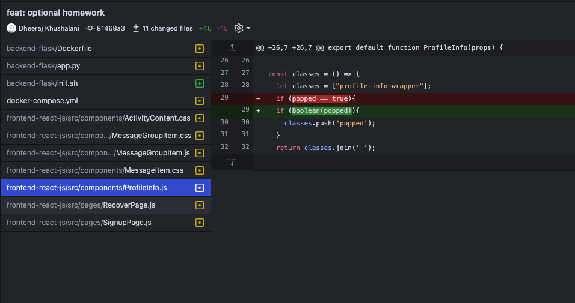
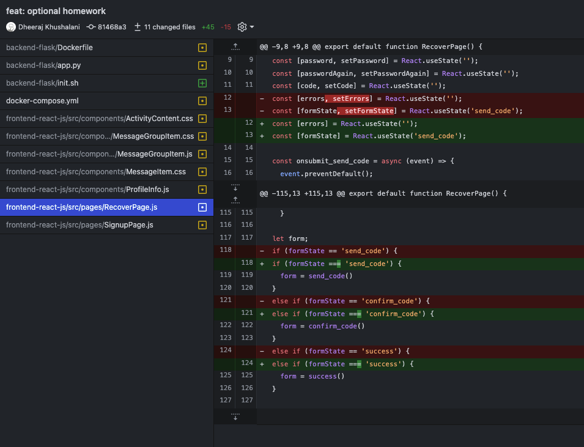
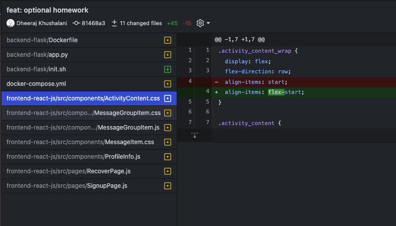
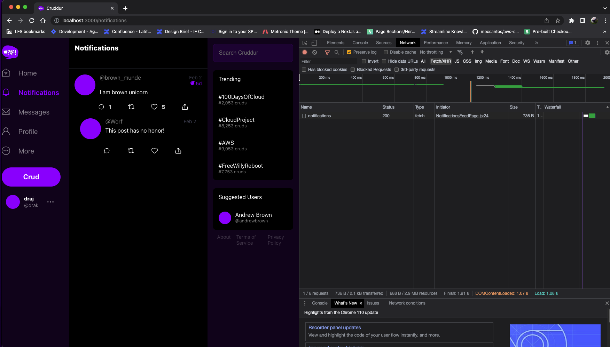
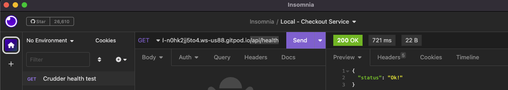
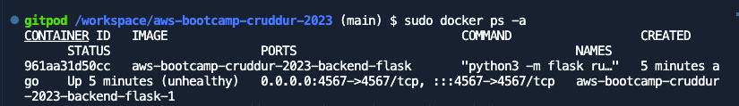
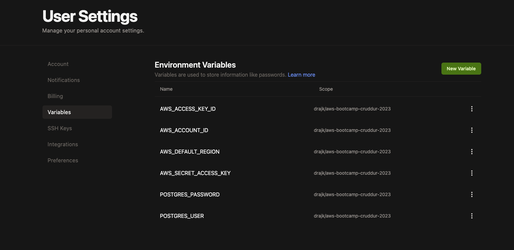

# Week 1 — App Containerization

## Required Homework

### Learn more about Containerising local development environments.

This can be verified using following files

[Backend - Docker](../backend-flask/Dockerfile)
[Frontend - Docker](../frontend-react-js/Dockerfile)
[Docker compose](../docker-compose.yml)

### Containerise backend and frontend and add more features.

- Explored codebase and solved lint errors, here are few example of lint fixes

- Added Notification endpoint and used it the React SPA.

### Setup docker compose to add local Dynamo DB and Postgres DB.

This can be verified using following files

[Docker compose](../docker-compose.yml)

### Learn about other CDEs like Git workspaces and AWS Cloud9.

## Optional home work

### Moved python installation to a bash script.

- This makes the installation and other bootstrap commands more maintainable and readable. 
- Here is the link to bash script

[init.sh](../backend-flask/init.sh)

### Added docker health-check for backend python api.

- Added health API endpoint (GET: /api/health) to be used for docker health check.
- These health checks can later be used in a dashboard indicating all unhealthy endpoint and potentially auto healing mrechanisms. 

### Moved Postgres database username and password to Gitpod environment variables.

- Moved Postgres username and password to environment variables so that they are secure and are not available in GIT.
- Secrets can later be moved to AWS Parameter store or Secrets manager.

