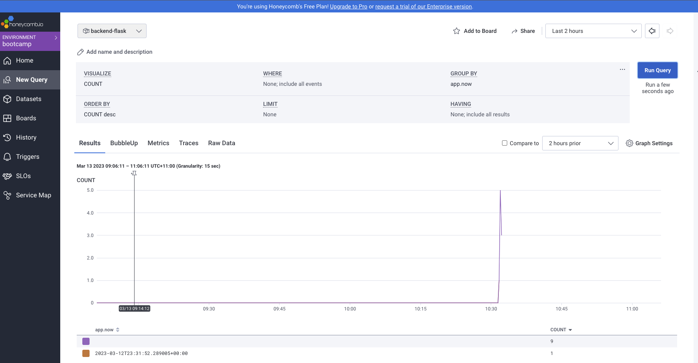
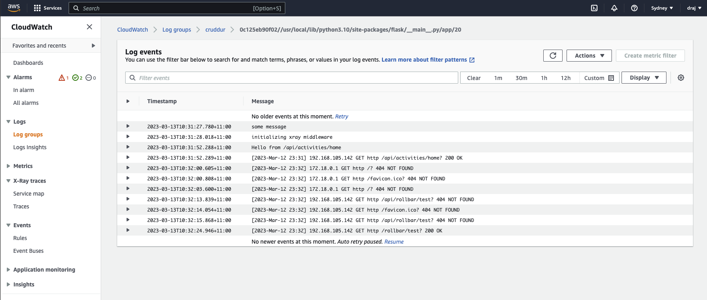
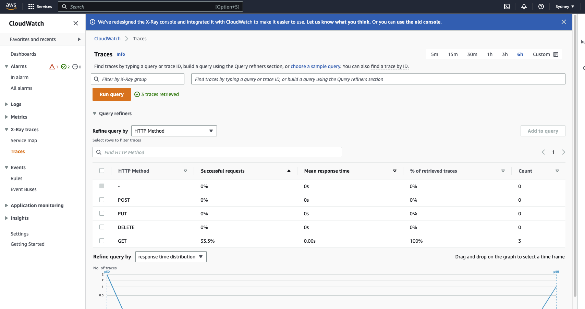
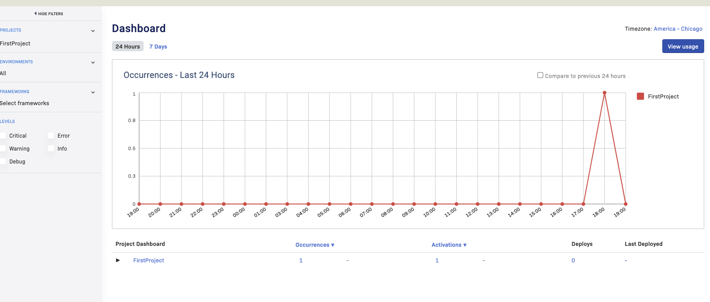

# Week 2 — Distributed Tracing

## Learn about observability using AWS services and other SAAS services.

## Configure backend flask codebase to use HoneyComb with custom fields and queries logs on Honeycomb.

## Configured backend flask to send logs to Cloudwatch

## Configured backend flask to use Xray using Xray daemon set up on local env

## Configured backend flask to use Rollbar.

## Learnt more about limits in free tier for Honeycomb, Rollbar, Xray and Cloudwatch.

## Optional homework

## Set up Honeycomb and Rollbar in frontend

I will be setting up Honeycomb and Rollbar in React codebase in week 3. 
Apologies for pushing it to the next week as I was running a little behind.
