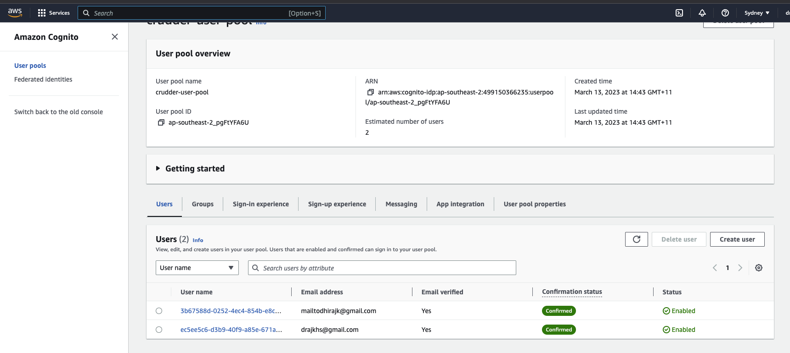
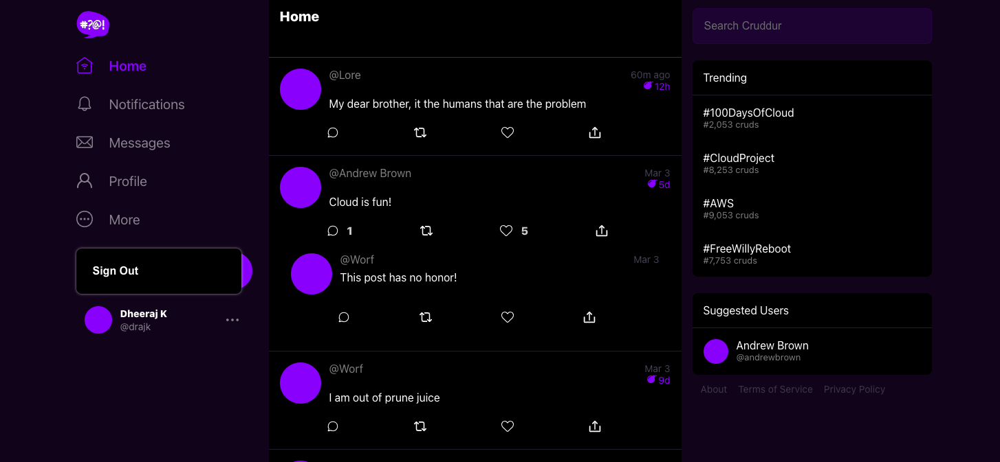
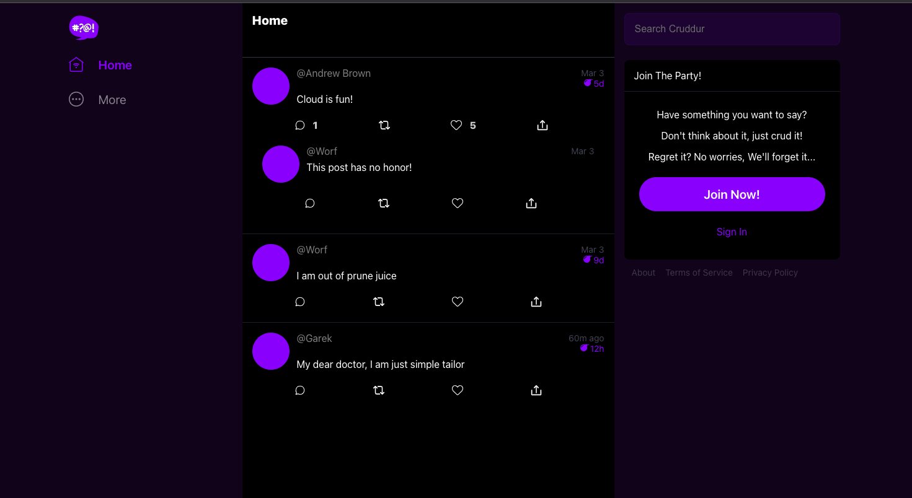
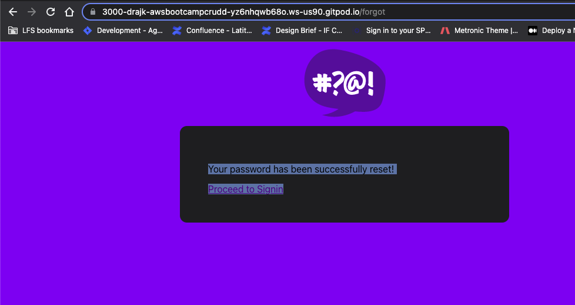
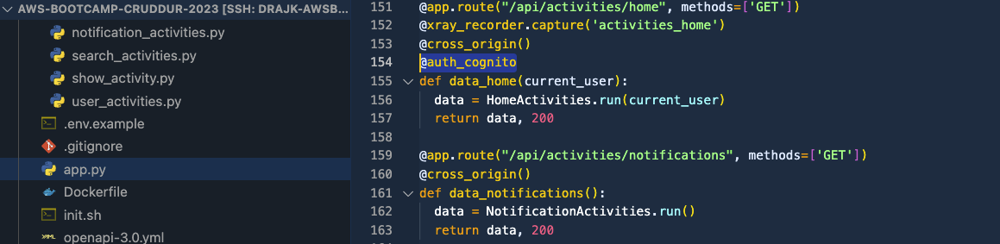

# Week 3 — Decentralized Authentication

## Created user pool on AWS Cognito. Click-ops

## Setup react frontend to use AWS cognito.
- Setup react frontend to use AWS cognito.
- Implemented Signin, Signout, Join and Forget Password in React codebase

- [Authenticated view]

- [Unauthenticated view]

## Configure JWT token verification in backend flask
[Verify Cognito JWTs](../backend-flask/lib/cognito_jwt_verify.py)

## Additional learnings
- Having worked with OKTA and Auth0 before, I knew about JWT and how we it should be used with Single page apps and REST APIs.
- Learnt about other ways to verify user tokens like sidecar pattern using NodeJS (or other language) as a AWS Lambda.
- Learn more on how to keep user session secure.

# Optional Homework

## Add authentication as a middleware
- [Auth Middleware](../backend-flask/middlewares/auth_cognito.py)
- [Sample usage] 

 